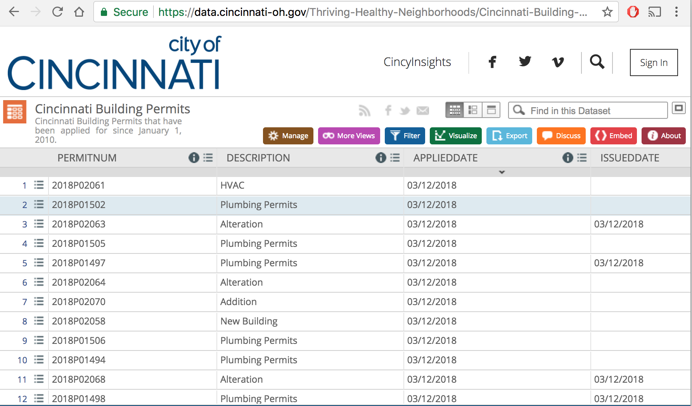

```{r setup, include=FALSE}
knitr::opts_chunk$set(echo = F, cache = T, warning = F, message = F)

# install.packages("revealjs")
# install.packages("wrapr")
# devtools::install_github("business-science/tibbletime")
# devtools::install_github("business-science/timetk")
# devtools::install_github("business-science/sweep")
# devtools::install_github("RamiKrispin/TSstudio")
# devtools::install_github("tidyverts/tsibble", build_vignettes = TRUE)

library(tidyverse)
library(TSstudio)
library(forecast)
library(tsibble)
library(tibbletime)
library(sweep)
library(timetk)
library(lubridate)
```


## Agenda
- Interactive visual exploration (**TSstudio**)
- From `ts` to **tidy** data (**tsibble** and **timetibble**)
- Easier modeling workflow (**timetk** and **sweep**)


## A little local data



## Fetch and wrangle

```{r message=FALSE, warning=FALSE, include = F}
data_file <- "data/permits.csv"
data_url <- "https://data.cincinnati-oh.gov/api/views/uhjb-xac9/rows.csv?accessType=DOWNLOAD"

# Download data if not already in place
if (!file.exists(data_file)) download.file(data_url, data_file)

permits <- read_csv(data_file) %>% 
  select(
    APP_DT = APPLIEDDATE,
    # ISU_DT = ISSUEDDATE,
    # CPL_DT = COMPLETEDDATE,
    CITY = ORIGINALCITY,
    STATE = ORIGINALSTATE,
    ZIP = ORIGINALZIP,
    HOOD = NEIGHBORHOOD,
    DESC = DESCRIPTION,
    PERMIT_CLS = PERMITCLASSMAPPED,
    WORK_CLS = WORKCLASSMAPPED,
    PERMIT_TYP = PERMITTYPEMAPPED,
    UNITS,
    FEE
  ) %>% 
  mutate_at(select_vars(names(.), contains("_DT")),
            as.Date, format = "%m/%d/%Y") %>% 
  # mutate_at(vars(DESCRIPTION, ORIGINALCITY, ORIGINALSTATE))
  mutate_if(. %>% {class(.) == "character"},      # remove extra ""
            . %>% {gsub('\\"', '', .)}) %>%       # in character cols
  mutate(FEE = as.numeric(gsub("[$]", "", FEE)))
  
```


```{r}
glimpse(permits)
```

[Cincinnati Building Permits Dataset](https://data.cincinnati-oh.gov/Thriving-Healthy-Neighborhoods/Cincinnati-Building-Permits/uhjb-xac9/data)


----

```{r}
permits %>% 
  group_by(APP_DT) %>% 
  summarise(APPS = n(),
            UNITS = sum(UNITS, na.rm = T)) %>% 
  ggplot(aes(APP_DT, APPS)) + 
  geom_line() + 
  labs(title = "Applications over time")
```

----


```{r}
prm_typ <- permits %>% 
  group_by(APP_DT, PERMIT_TYP) %>%
  summarise(APPS = n(),
            UNITS = sum(UNITS, na.rm = T)) %>%
  ungroup()
```


```{r}
prm_typ %>% 
  ggplot(aes(APP_DT, APPS, color = PERMIT_TYP)) + 
  geom_line() + 
  labs(title = "Applications over time, by permit type")
```

## Some jobs more common

```{r}
count(prm_typ, PERMIT_TYP, sort = T)
```


----


## TS Studio
> The TSstudio package provides a set of tools 
> for descriptive analysis of a time series data
> supporting “ts”, “mts”, “zoo” and “xts” objects.

<br>
<h3>Wrappers for <b class="purple">Plot.ly</b></h3>
<br>
from [Rami Krispin](https://github.com/RamiKrispin/TSstudio)

---

### Make a monthly time series

```{r, echo = T}
prm_mth <- permits %>% 
  mutate(YR_MTH = format(APP_DT, "%Y_%m")) %>% 
  group_by(YR_MTH) %>%
  summarise(APPS = n(),
            UNITS = sum(UNITS, na.rm = T)) %>%
  ungroup() %>% 
  arrange(YR_MTH) %>% 
  filter(YR_MTH < "2018_03")


(prm_ts_mth <- prm_mth %>% 
  {ts(data = .$APPS, 
      start = as.numeric(unlist(strsplit(.$YR_MTH[1], "_"))),
      frequency = 12)})
```

----
```{r, echo = T}
ts_plot(prm_ts_mth, title = "Monthly Permit Applications")
```

----

```{r}
# permits %>%
#   mutate(YR_MTH = format(APP_DT, "%Y_%m")) %>% 
#   group_by(YR_MTH, PERMIT_TYP) %>%
#   summarise(APPS = n(),
#             UNITS = sum(UNITS, na.rm = T)) %>%
#   ungroup() %>% 
#   arrange(YR_MTH) %>% 
#   select(-UNITS) %>% 
#   spread(PERMIT_TYP, APPS) %>% 
#   arrange(YR_MTH) %>% 
#   {ts()}
```

## Nice seasonality plots
```{r echo=T, warning=FALSE}
ts_seasonal(prm_ts_mth, type = "normal")
```

----

```{r echo=T, warning=FALSE}
ts_seasonal(prm_ts_mth, type = "cycle")
```


----
```{r echo=T, warning=FALSE}
ts_seasonal(prm_ts_mth, type = "box")
```

## Convenient type="all"

```{r warning=FALSE}
ts_seasonal(prm_ts_mth, type = "all")
```


## Fancy plots, too

- heatmaps (`ts_heatmap`)
- 3d surface plots (`ts_surface`)
- polar plot (`ts_polar`)
- seasonality decomposition (`ts_decompose`)
- auto-correlation (`ts_acf`, `ts_pacf`, `ts_lags`)
- forecast fitted + prediction vs actuals (`test_forecast`)

----

### Additive & multiplicative together
```{r echo=T}
ts_decompose(prm_ts_mth, type = "both")
```

----

```{r echo=T}
ts_pacf(prm_ts_mth, lag.max = 24)
```


----
```{r echo=T}
ts_lags(prm_ts_mth)
```


## Residuals plot
```{r}

# set the forecast horizon for 12 months
h <- 12

# Split the data into training and testing sets (leaving the last 12 months for testing)
split_prm <- ts_split(prm_ts_mth, sample.out = h)
train <- split_prm$train
test <- split_prm$test

# Building a model on the training set
fit <- auto.arima(train, lambda = BoxCox.lambda(train))

# Checking the residuals
check_res(fit)

```


## Evaluating forecasts visually

```{r}
fc <- forecast(fit, h = h)
test_forecast(actual = prm_ts_mth, forecast.obj = fc, test = test)
```


## ts isn't **tidy**
Two options:
  
<br>


- **tibbletime** from [Business Science](http://www.business-science.io/)
- **tsibble** from [Aero Wang](https://earo.me/) under Rob Hyndman 
- Both define an enchanced `tbl_df`


## Back to the start

```{r echo = T}
(prm_typ <- permits %>% 
  group_by(APP_DT, PERMIT_TYP) %>%
  summarise(APPS = n(),
            UNITS = sum(UNITS, na.rm = T)) %>%
  ungroup())
```

## tsibble


```{r echo = T}
(prm_tsbl <- as_tsibble(prm_typ, key = id(PERMIT_TYP)))
```

- each observation **uniquely** identified by index and key
- optionally **multi-level** and **cross-category** index

## Convenient <b class="purple">dplyr</b> aggregation


```{r echo = T}
prm_mth <- prm_tsbl %>%
  group_by(PERMIT_TYP) %>%
  tsummarise(
    date = yearmonth(APP_DT),
    min_units = max(UNITS, na.rm = TRUE),
    max_units = min(UNITS, na.rm = TRUE)
  )
```


- special `tsummarise` function
- aware of date index
- plays nicely with **lubridate** functions 
  
  
   
   
## Convenient <b class="purple">dplyr</b> aggregation

```{r}
prm_mth
```

## Easy date padding

```{r}
head(prm_tsbl, 5)
```

```{r echo=T}
fill_na(prm_tsbl, APPS = 0L) %>% head(8)
```


## timetibble


```{r echo = T}
(prm_tmtbl <- as_tbl_time(permits, index = APP_DT) %>% arrange(APP_DT))
```

- also aware of time index
- doesn't require uniquely indexed records
- syntactic sugar for filtering by date


---- 

### Handy filtering syntax

```{r echo = T}
filter_time(prm_tmtbl, '2014' ~ '2016')
```
  
  
- Useful for interactive exploration, but definitely not for programmatic use

----

### Temporal aggregation more mysterious

```{r echo = T}
prm_tmtbl %>% 
  group_by(PERMIT_TYP) %>% 
  collapse_by(period = "monthly") %>% 
  group_by(APP_DT, add = T) %>% 
  summarise(UNITS = mean(UNITS, na.rm = T))


```
  

## <b class="purple">tidy</b> forecasting with helpers

The forecasting workflow involves a few basic steps:

1. Coerce to a `ts` object class.
2. Apply a model (or set of models)
3. Forecast the models (similar to predict)
4. Tidy the forecast

<br>

- Packages **timetk** and **sweep** help make process of going from grouped `tibble` -> `ts` -> `forecast` -> summary `tibble` easier.

## Autodetect time index

```{r echo = T}
prm_daily <- permits %>% 
  group_by(APP_DT) %>% 
  summarise(APPS = n(), UNITS = sum(UNITS, na.rm = T))
            
prm_daily %>% tk_index() %>% tk_get_timeseries_summary() %>% glimpse
```


## Convert to ts

```{r echo = T}
daily_ts <- prm_daily %>% 
  {tk_ts(., start = c(year(min(.$APP_DT)), yday(min(.$APP_DT))/365.25),
    freq = 365.25)}

head(daily_ts)
class(daily_ts)
```


## ... and back to tibble
```{r, echo = T}
tk_tbl(daily_ts, rename_index = "APP_DT")
```


## Sweeping up model results
Remember our ARIMA model `fit`?
```{r}
summary(fit)
```


## Sweeping up model results

**sweep** is just like **broom** but for models produced by **forecast**


```{r echo = T}
sw_tidy(fit)
```

-----

### glance at accuracy measures

```{r echo = T}
sw_glance(fit) %>% glimpse
```

## End

<br>
<br>
<br>
Find this presentation on Github:
https://github.com/epspi/CIN-DAY_RUG_03.14.2018

